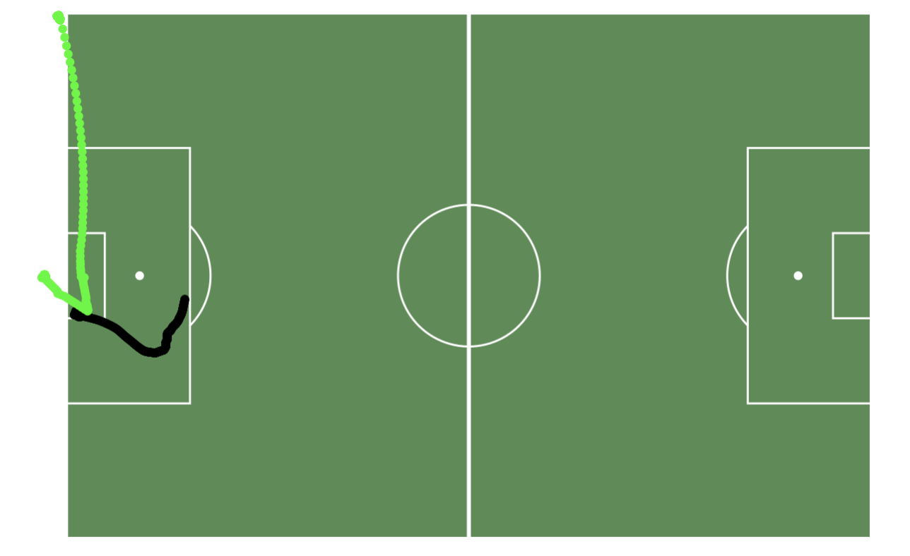
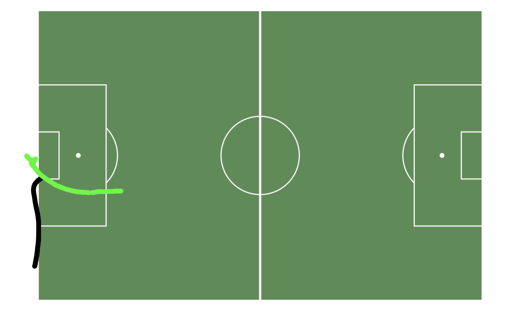
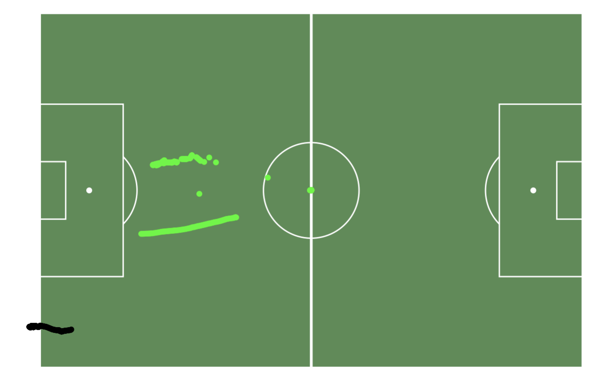

# 📍 Identifying Shots from MLS Tracking Data

---

## 🎯 Goal

Determine how many shots a specific player took during an MLS match using only GPS tracking data without access to traditional event data.

---

## 💡 Hypothesis

With sufficiently frequent positional data from both the player and the ball, it's possible to algorithmically infer shot events by analyzing patterns of proximity and directional movement toward goal.

---

## 📊 Data

- **Source:** High-frequency GPS tracking data (25Hz; one frame every 0.04 seconds) for all 22 players and the ball.
- **Structure:** Each row represents a single frame with X and Y coordinates for each object.
- **Challenge:** No explicit event tags (e.g., shots or passes); all shot attempts must be inferred from position data alone.

---

## 🧠 Methods

1. **Data Structuring**
   - Reformatted raw tracking data to isolate the coordinates of the player and ball for every frame.
   - Divided data by match half to account for goal direction changes.

2. **Possession Detection**
   - Identified all frames where the ball was within 1 yard (in both X and Y directions) of the player’s position to estimate ball possession.

3. **Ball Release Events**
   - Filtered to moments where the ball exited the 1-yard proximity between one frame and the next—interpreted as a pass, shot, or other ball action.

4. **Toward-Goal Filtering**
   - From those release events, selected instances where the ball subsequently moved closer to the goal.

5. **Manual Review**
   - Narrowed down to 14 potential shot events.
   - Visualized each sequence and manually reviewed plots to determine whether they represented a shot.

---

## 🖼️ Example Shot Sequence Plot

&nbsp;
- The ball comes in from the corner 
&nbsp;

 
&nbsp;

- The player scores and then runs to the corner to celebrate 
&nbsp;

 
&nbsp;

- The other team takes the ball back to midfield 
&nbsp;

 
&nbsp;
 

---

## ✅ Outcome

- Identified **4** shot events for the player:
  - **2** saved by the goalkeeper
  - **1** blocked by a defender
  - **1** goal scored from a corner 
- Confirmed that player/ball proximity and directional tracking data can be used effectively to reconstruct shot attempts in the absence of event data.

---

## 🛠️ Tools

- **R** (`tidyverse`, `ggplot2`)

---
